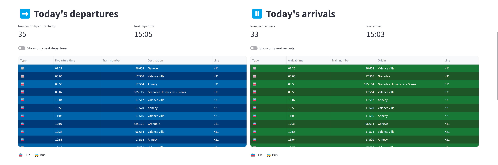
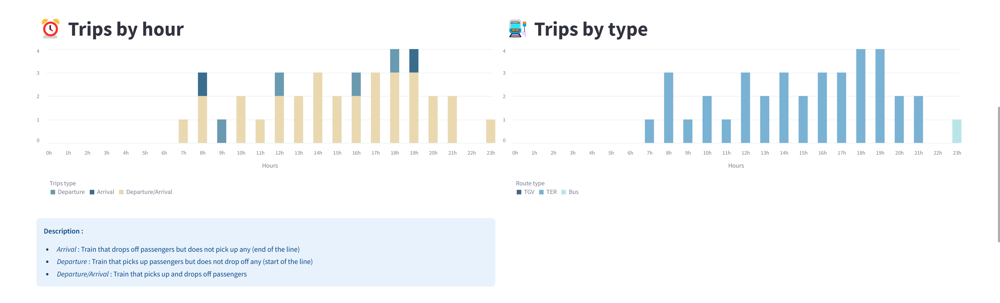
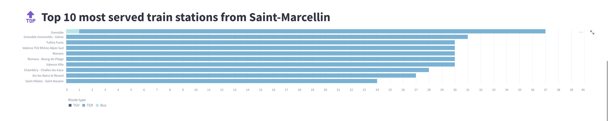
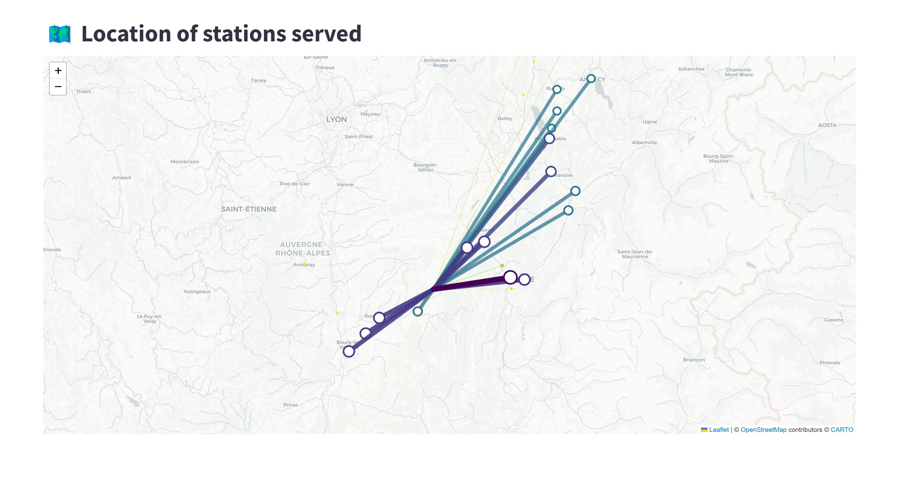

# :train2: Train Offer by Station in France

A simple streamlit app showing key metrics of the SNCF railway offer in France based on GTFS Schedule feeds

[](https://trainofferbystationfr-zy5ykjzbgtujc23v6zvkaj.streamlit.app/)

## Presentation

### Data sources

- **TER GTFS (_Horaires des lignes TER_) :**
  - Description : [TER](https://www.sncf-voyageurs.com/fr/voyagez-avec-nous/en-france/ter/carte-ter/) network (local trains ans bus)
  - Metadata : [https://ressources.data.sncf.com/explore/dataset/sncf-ter-gtfs/information/](https://ressources.data.sncf.com/explore/dataset/sncf-ter-gtfs/information/)
  - Download link : [https://eu.ftp.opendatasoft.com/sncf/gtfs/export-ter-gtfs-last.zip](https://eu.ftp.opendatasoft.com/sncf/gtfs/export-ter-gtfs-last.zip)
- **TGV GTFS (_Horaires des TGV_) :**
  - Description : TGV network (high speed trains)
  - Metadata : [https://data.sncf.com/explore/dataset/horaires-des-train-voyages-tgvinouiouigo/information/](https://data.sncf.com/explore/dataset/horaires-des-train-voyages-tgvinouiouigo/information/)
  - Download link : [https://eu.ftp.opendatasoft.com/sncf/gtfs/export_gtfs_voyages.zip](https://eu.ftp.opendatasoft.com/sncf/gtfs/export_gtfs_voyages.zip)

GTFS files examples available [here](https://github.com/jc-telecom/train_offer_by_station_fr/tree/main/GTFS%20feed%20examples)

### Indicators

#### _Today's departures_ and _Today's arrivals_

Time table of today's trip as it would be displayed in station



#### _Trips by hour_ and _Trips by type_

Distribution of (1) departures, arrivals and departures/arrivals and (2) trips type (TGV, TER or bus) by hour



#### _Top 10 most served train stations_

Top 10 most served station from the selected station with trips type detail


#### _Top 10 most served train stations_

Map of stations served from the selected station


## How to run it on your own machine

1. Clone repo
   ```
   $ git clone https://github.com/jc-telecom/train_offer_by_station_fr.git
   ```
2. Install the requirements
   ```
   $ pip install -r requirements.txt
   ```
3. Run the app

   ```
   $ streamlit run app.py
   ```

## Next steps

- [ ] Integrate Trenitalia GTFS feed
- [ ] Integrate additional station information (opening hours, ridership, equipments)
<!-- 
Comment code
Add description
Clean Github s
Publish

v2
Integrate https://ressources.data.sncf.com/explore/dataset/frequentation-gares/table/?disjunctive.nom_gare&disjunctive.code_postal

Integrate :
https://ressources.data.sncf.com/explore/dataset/objets-trouves-restitution/table/?sort=date
https://ressources.data.sncf.com/explore/dataset/objets-trouves-gares/table/?sort=date

https://ressources.data.sncf.com/explore/dataset/gares-equipees-du-wifi/table/?sort=nom_de_la_gare

Sticky city choose -->
